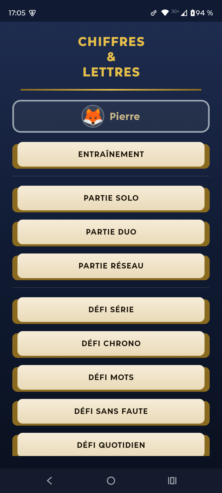
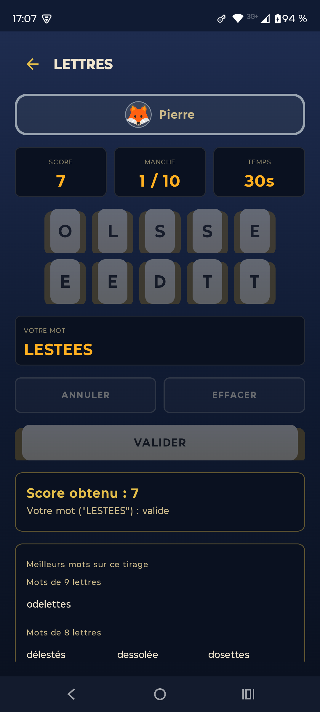
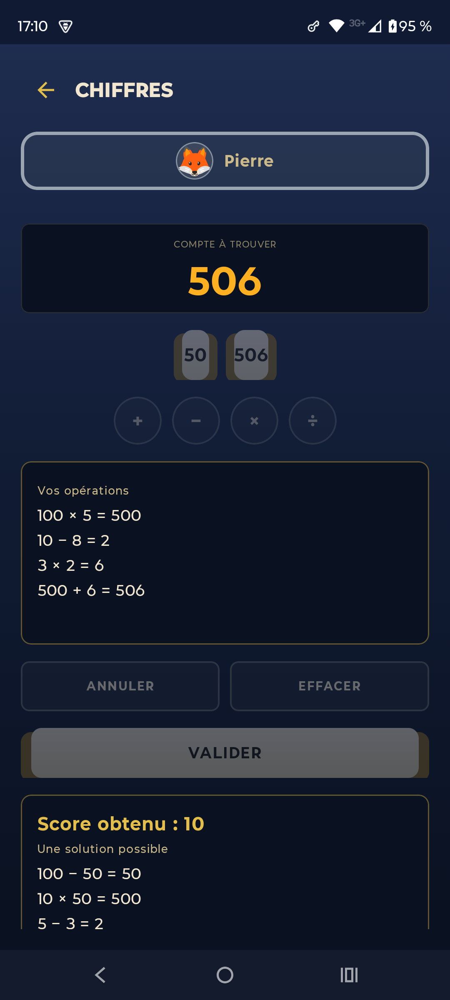

<p align="center">
  
</p>

<h1 align="center">Chiffres & Lettres</h1>

<p align="center">
  Calcul mental et vocabulaire, sans pub ni traqueur.
</p>

<p align="center">
  <a href="LICENSE"></a>
  
</p>

Jeu de calcul mental et de vocabulaire, dans l'esprit du célèbre jeu télévisé français du même principe, sans aucune affiliation avec celui-ci.

<p align="center">
  
  
  
</p>

## Fonctionnalités

Deux modes de jeu :

- **Chiffres** : 6 nombres sont tirés ainsi qu'une cible à atteindre. Construisez votre calcul pas à pas façon calculatrice, en combinant les nombres avec les 4 opérations.
- **Lettres** : 10 lettres sont tirées. Trouvez le mot le plus long possible avec ces lettres, avant la fin du temps imparti.

Plusieurs façons de jouer :

- Partie solo, sur 4 niveaux de difficulté croissante (Émile, Nestor, Monique, Mathieu), alternant manches chiffres et lettres.
- Partie duo, à deux joueurs sur le même téléphone, avec un mode Duo (chacun son score) ou Confrontation (un seul gagnant par manche).
- Partie réseau, la même partie duo mais sur deux téléphones séparés, connectés en Wifi ou Bluetooth.
- Défi quotidien, avec un objectif tiré au sort chaque jour et des trophées pour les séries de jours réussis.
- Défis série, chrono, mots et sans faute, pour progresser à son rythme.
- Mode entraînement libre, sans limite de temps ni de manches.

L'application garde vos statistiques et récompense votre progression par des trophées, propose un thème clair ou sombre, et fonctionne entièrement hors ligne : aucune publicité, aucun traqueur, aucune connexion réseau requise (sauf pour jouer en partie réseau).

*An English description is available in [`fastlane/metadata/android/en-US/full_description.txt`](fastlane/metadata/android/en-US/full_description.txt).*

## Installation

[](https://f-droid.org/packages/fr.pierre.chiffreslettres/)

*Suivi de l'intégration à F-Droid : [merge request fdroiddata #45293](https://gitlab.com/fdroid/fdroiddata/-/merge_requests/45293).*

Vous pouvez aussi compiler l'application depuis les sources — voir ci-dessous.

## Compiler le projet

Le module Android principal est `app` (les modules `core-numbers`, `core-letters`, `core-dictionary` et `data` sont des dépendances locales).

```
./gradlew :app:assembleDebug
```

L'APK debug se trouve ensuite dans `app/build/outputs/apk/debug/`.

Un build release nécessite un `keystore.properties` local (non fourni, voir `.gitignore`) — sans lui, seul le build debug fonctionne.

## Licence

Logiciel libre sous licence [GNU GPL-3.0-only](LICENSE).

## Signaler un problème

Utilisez les [issues GitHub](https://github.com/Pierre-21-git/chiffreslettres/issues).
